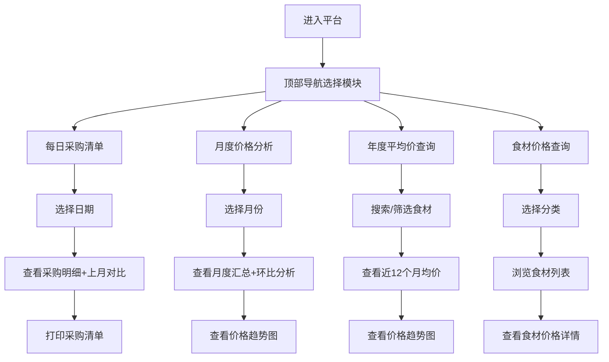

## 1. 产品概述

食材采购管理平台是一款面向餐饮企业、食堂和生鲜采购人员的专业管理工具，帮助用户高效管理每日采购清单、追踪食材价格变动、进行月度成本分析和历史价格查询。通过直观的数据可视化和便捷的打印功能，助力采购决策优化和成本控制。

- 核心目标：简化采购流程、透明化价格对比、辅助成本决策
- 目标用户：餐饮企业采购人员、食堂管理员、生鲜超市经营者
- 核心价值：提高采购效率、降低采购成本、数据驱动决策

## 2. 核心功能

### 2.1 用户角色
| 角色 | 注册方式 | 核心权限 |
|------|---------|---------|
| 采购管理员 | 系统登录 | 采购清单管理、价格查询、数据分析、报表打印 |

### 2.2 功能模块
1. **每日采购清单**：当日采购明细、多单位支持、上月同期价格对比、一键打印
2. **月度价格分析**：月度采购汇总、环比上月对比、图表可视化
3. **年度价格查询**：近12个月平均价查询、价格趋势图、食材分类筛选
4. **食材分类管理**：食材分类导航、多单位配置、价格搜索、食材详情

### 2.3 页面详情
| 页面名称 | 模块名称 | 功能描述 |
|---------|---------|----------|
| 每日采购清单 | 日期选择器 | 切换查看不同日期的采购清单 |
| 每日采购清单 | 采购明细表格 | 展示食材名称、分类、采购单位、数量、单价、金额、基准单价、上月基准单价、价格变动率 |
| 每日采购清单 | 分类汇总 | 按食材分类汇总采购金额 |
| 每日采购清单 | 打印功能 | 一键打印当日采购清单，含价格对比信息 |
| 月度价格分析 | 月份选择器 | 选择查看不同月份的分析数据 |
| 月度价格分析 | 月度汇总表 | 各分类采购金额、数量、均价及环比变化 |
| 月度价格分析 | 价格趋势图 | 月度价格走势可视化图表 |
| 月度价格分析 | Top涨跌榜 | 价格涨幅和跌幅最大的食材排行 |
| 年度平均价查询 | 食材搜索 | 按名称搜索食材 |
| 年度平均价查询 | 分类筛选 | 按食材分类筛选 |
| 年度平均价查询 | 平均价表格 | 展示近12个月各月均价及年度平均 |
| 年度平均价查询 | 趋势折线图 | 价格趋势可视化展示 |
| 食材价格查询 | 分类导航 | 按蔬菜、肉类、水产、调料等分类浏览 |
| 食材价格查询 | 价格详情 | 查看食材历史价格、当前价格、多单位价格换算、价格变动 |
| 食材价格查询 | 单位管理 | 基准单位、常用采购单位、换算系数配置 |

## 3. 核心流程

用户进入平台后，可通过顶部导航切换不同功能模块：
1. 在每日采购清单页选择日期，查看当日采购明细及上月同期对比，可打印清单
2. 在月度价格分析页选择月份，查看月度汇总数据、环比分析和趋势图表
3. 在年度平均价查询页搜索或筛选食材，查看近一年价格趋势和平均价
4. 在食材价格查询页按分类浏览食材，查看详细价格信息

## 4. 用户界面设计

### 4.1 设计风格
- **主色调**：深绿色 (#1a5c3a) - 象征新鲜、健康、自然
- **辅助色**：橙黄色 (#f59e0b) - 用于强调、价格上涨标识
- **下跌色**：翠绿色 (#10b981) - 用于价格下跌标识
- **背景色**：米白色 (#faf8f5) - 温暖、干净的质感
- **卡片背景**：纯白色 (#ffffff) - 清晰的内容区域
- **按钮风格**：圆角矩形，主按钮深绿色填充，悬停有微动效
- **字体**：标题使用 Noto Serif SC（衬线体，专业感），正文使用 Noto Sans SC（无衬线体，可读性）
- **布局风格**：顶部导航 + 侧边分类 + 主内容区卡片式布局
- **图标风格**：线性图标，统一2px描边，圆角处理

### 4.2 页面设计概述
| 页面名称 | 模块名称 | UI元素 |
|---------|---------|--------|
| 每日采购清单 | 页面头部 | 日期选择器、打印按钮、总金额卡片 |
| 每日采购清单 | 分类汇总区 | 彩色分类卡片，展示各分类金额占比 |
| 每日采购清单 | 明细表格 | 斑马纹表格，价格变动率带颜色标识，悬停行高亮 |
| 月度价格分析 | 数据概览 | 4个统计卡片（总采购额、采购品类数、均价环比、价格波动数） |
| 月度价格分析 | 趋势图表 | 面积图展示月度价格走势 |
| 月度价格分析 | 涨跌榜单 | 两列布局，涨幅榜橙红色调，跌幅榜绿色调 |
| 年度平均价查询 | 搜索筛选区 | 搜索框 + 分类标签筛选 |
| 年度平均价查询 | 均价表格 | 12个月均价横向排列，年度平均高亮 |
| 年度平均价查询 | 趋势图 | 折线图展示价格走势，带数据点 |
| 食材价格查询 | 分类侧边栏 | 可折叠分类树，带食材数量徽标 |
| 食材价格查询 | 食材卡片网格 | 卡片展示食材图片、名称、当前价、涨跌额 |

### 4.3 响应式
- 桌面端优先设计（1440px基准）
- 平板端（768px-1024px）：侧边栏收起为图标模式，表格支持横向滚动
- 移动端（<768px）：顶部导航变为底部Tab栏，卡片垂直堆叠，表格简化展示

### 4.4 动效设计
- 页面切换：淡入 + 轻微上移动效，时长300ms
- 数据卡片：入场时错峰渐显（staggered animation）
- 价格变动：数字变化时有滚动计数动效
- 表格行：悬停时背景色渐变过渡
- 按钮：点击时有缩放反馈（scale: 0.97）
