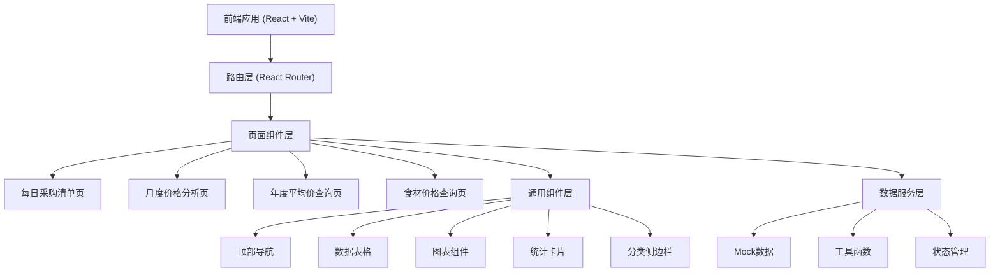
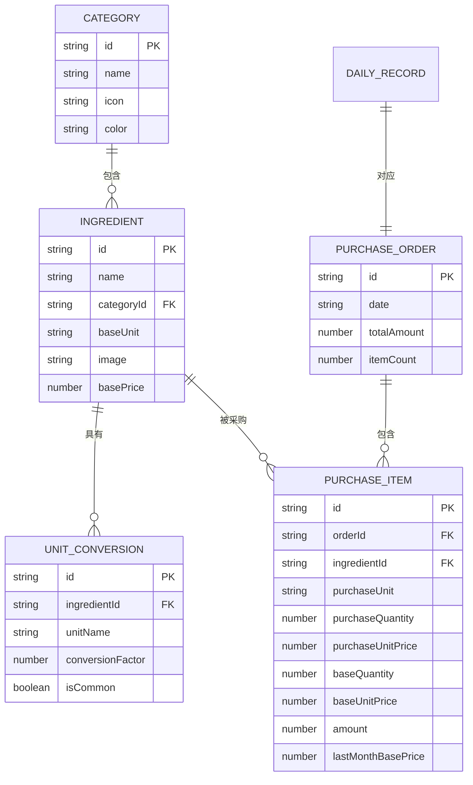

## 1. 架构设计



## 2. 技术描述

- **前端框架**：React@18 + TypeScript
- **构建工具**：Vite@5
- **样式方案**：TailwindCSS@3
- **路由管理**：React Router DOM@6
- **图表库**：Recharts（React生态友好，支持多种图表类型）
- **图标库**：Lucide React（轻量、现代的线性图标）
- **日期处理**：date-fns（轻量日期工具库）
- **后端**：无后端，使用 Mock 数据模拟
- **数据存储**：本地 JSON 数据 + localStorage 持久化（可选）

## 3. 路由定义

| 路由路径 | 页面名称 | 功能描述 |
|---------|---------|---------|
| / | 每日采购清单 | 默认首页，展示当日采购清单及上月对比 |
| /daily | 每日采购清单 | 每日采购明细、分类汇总、打印功能 |
| /monthly | 月度价格分析 | 月度采购汇总、环比分析、趋势图表、涨跌榜 |
| /yearly | 年度平均价查询 | 近12个月平均价、价格趋势、搜索筛选 |
| /ingredients | 食材价格查询 | 分类浏览、食材详情、价格历史 |

## 4. 数据模型

### 4.1 数据实体关系



### 4.2 核心数据结构定义

```typescript
// 食材分类
interface Category {
  id: string;
  name: string;
  icon: string;
  color: string;
}

// 单位换算
interface UnitConversion {
  unit: string;
  factor: number;
  isCommon?: boolean;
}

// 食材
interface Ingredient {
  id: string;
  name: string;
  categoryId: string;
  baseUnit: string;
  basePrice: number;
  image: string;
  units: UnitConversion[];
}

// 采购明细项
interface PurchaseItem {
  id: string;
  ingredientId: string;
  ingredientName: string;
  categoryId: string;
  categoryName: string;
  purchaseUnit: string;
  purchaseQuantity: number;
  purchaseUnitPrice: number;
  baseQuantity: number;
  baseUnit: string;
  baseUnitPrice: number;
  amount: number;
  lastMonthBasePrice: number;
  priceChange: number;
  priceChangeRate: number;
}

// 每日采购记录
interface DailyPurchaseRecord {
  date: string;
  items: PurchaseItem[];
  totalAmount: number;
  categorySummary: CategorySummary[];
}

// 分类汇总
interface CategorySummary {
  categoryId: string;
  categoryName: string;
  color: string;
  amount: number;
  percentage: number;
  itemCount: number;
}

// 月度分析数据
interface MonthlyAnalysis {
  yearMonth: string;
  totalAmount: number;
  itemCount: number;
  avgPrice: number;
  lastMonthTotalAmount: number;
  lastMonthAvgPrice: number;
  amountChangeRate: number;
  priceChangeRate: number;
  categoryBreakdown: CategoryMonthlyData[];
  topGainers: PriceChangeItem[];
  topLosers: PriceChangeItem[];
  monthlyTrend: MonthlyTrendPoint[];
}

// 分类月度数据
interface CategoryMonthlyData {
  categoryId: string;
  categoryName: string;
  color: string;
  totalAmount: number;
  avgPrice: number;
  lastMonthAvgPrice: number;
  priceChangeRate: number;
  amountPercentage: number;
}

// 价格变动项
interface PriceChangeItem {
  ingredientId: string;
  ingredientName: string;
  categoryName: string;
  baseUnit: string;
  currentPrice: number;
  lastPrice: number;
  changeRate: number;
}

// 月度趋势点
interface MonthlyTrendPoint {
  month: string;
  totalAmount: number;
  avgPrice: number;
}

// 年度均价数据
interface YearlyPriceData {
  ingredientId: string;
  ingredientName: string;
  categoryName: string;
  baseUnit: string;
  yearlyAvg: number;
  monthlyPrices: MonthlyPrice[];
}

// 单月价格
interface MonthlyPrice {
  month: string;
  avgPrice: number;
  minPrice: number;
  maxPrice: number;
}
```

### 4.3 Mock 数据规划

- **分类数据**：6-8个主要分类（蔬菜、肉类、水产、调料、粮油、蛋奶、豆制品、水果）
- **食材数据**：每个分类10-15种食材，共约80-100种
- **单位体系**：
  - 基准单位：统一用于价格对比的标准单位（如：公斤、个、升等）
  - 常用采购单位：斤、箱、包、袋、件等，带换算系数
  - 示例：白菜（基准单位：公斤，采购单位：斤，换算系数0.5）
- **每日采购数据**：生成近30天 + 上月同期数据，每天30-50种食材
- **月度数据**：生成近12个月的汇总数据
- **价格波动**：模拟真实市场价格波动，涨跌幅度在-15%到+20%之间

## 5. 项目目录结构

```
src/
├── assets/              # 静态资源
│   └── images/          # 食材图片
├── components/          # 通用组件
│   ├── Layout/          # 布局组件
│   │   ├── Header.tsx   # 顶部导航
│   │   └── Sidebar.tsx  # 侧边栏
│   ├── DataTable/       # 数据表格
│   ├── StatCard/        # 统计卡片
│   ├── Charts/          # 图表组件
│   └── common/          # 通用UI组件
├── pages/               # 页面组件
│   ├── DailyPurchase/   # 每日采购清单
│   ├── MonthlyAnalysis/ # 月度价格分析
│   ├── YearlyPrice/     # 年度平均价查询
│   └── IngredientQuery/ # 食材价格查询
├── data/                # Mock数据
│   ├── categories.ts    # 分类数据
│   ├── ingredients.ts   # 食材数据
│   ├── dailyRecords.ts  # 每日采购记录
│   └── monthlyData.ts   # 月度分析数据
├── utils/               # 工具函数
│   ├── date.ts          # 日期处理
│   ├── price.ts         # 价格计算
│   └── format.ts        # 格式化
├── hooks/               # 自定义Hooks
├── types/               # TypeScript类型定义
├── App.tsx              # 应用入口
├── main.tsx             # 渲染入口
└── index.css            # 全局样式
```

## 6. 关键技术实现点

1. **打印功能**：使用 `window.print()` + 专门的打印样式 (`@media print`)，确保打印输出美观规范
2. **数据可视化**：使用 Recharts 实现折线图、面积图、饼图等多种图表
3. **单位换算系统**：
   - 每种食材设置基准单位，用于价格对比的统一口径
   - 支持多采购单位，通过换算系数自动转换为基准单位
   - 价格对比、月度分析、年度均价均基于基准单位计算，确保数据可比性
4. **响应式布局**：TailwindCSS 响应式类实现多端适配
5. **动画效果**：CSS transition + 微交互动效
6. **性能优化**：数据分页、React.memo 优化渲染
